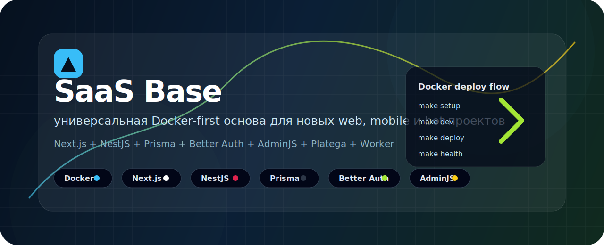
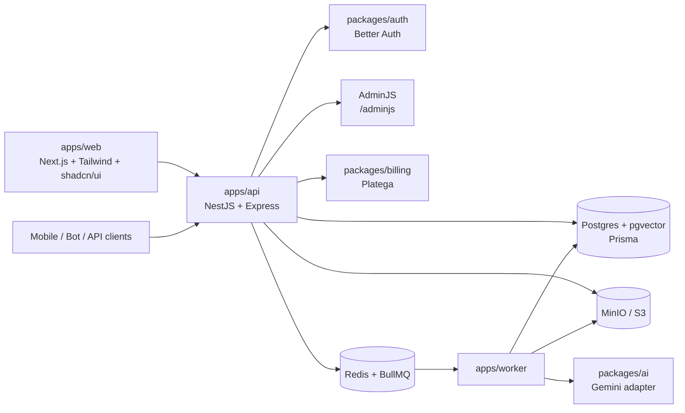

<p align="center">
  
</p>

<p align="center">
  <a href="#quick-start"></a>
  <a href="#stack"></a>
  <a href="#stack"></a>
  <a href="#database"></a>
  <a href="#auth"></a>
</p>

<p align="center">
  
  
  
  
  
  
</p>

# SaaS Base

**SaaS Base** - универсальная базовая платформа для будущих проектов: web-приложений, админок, mobile/API clients, Telegram-ботов и worker-задач. Репозиторий собран как monorepo и сразу даёт фундамент, который обычно приходится писать с нуля: авторизация, роли, REST API, Swagger, платежи, БД, очереди, файловое хранилище, AdminJS и Docker-first деплой.

Главный принцип: **новая машина или сервер должны поднять проект одной-двумя командами без ручного разбора зависимостей**.

<a id="what-is-inside"></a>

## Что Уже Есть

| Блок | Что внутри |
| --- | --- |
| Web client | `Next.js 16`, App Router, TypeScript, Tailwind, shadcn/ui, страницы auth-flow |
| API backend | `NestJS + Express`, REST API, Swagger/OpenAPI, единая точка для web/mobile/bot |
| Auth | Better Auth, cookie/session для web, bearer/JWT для non-web клиентов |
| RBAC | Глобальные роли `user`, `admin`, `support`, guard/policy слой в API |
| AdminJS | Data admin на `/adminjs`, все Prisma models подключаются автоматически |
| Billing | Platega payment links, webhook, entitlements foundation |
| Database | PostgreSQL + pgvector, Prisma schema/client/seed |
| Queue | Redis + BullMQ worker runtime |
| Storage | MinIO/S3-compatible integration shape |
| AI | Gemini-first adapter и слой под AI use-cases |
| Docker | Production-like compose, dev compose, build cache, healthchecks, restart policy |
| Logs | Единый server log в Docker volume `server-logs` |

<a id="stack"></a>

## Стек

| Layer | Technology |
| --- | --- |
| Frontend | Next.js, React, TypeScript, Tailwind CSS, shadcn/ui |
| Backend | NestJS, Express, Better Auth, Zod |
| Data | PostgreSQL, pgvector, Prisma |
| Admin | AdminJS + Prisma adapter |
| Background jobs | Redis, BullMQ |
| Storage | MinIO locally, S3-compatible provider in production |
| Payments | Platega |
| Tooling | pnpm, Turbo, ESLint, Prettier |
| Runtime | Docker, Docker Compose |

## Архитектура



## Почему Это Удобно

- **Docker-first**: на сервере не нужен локальный `pnpm install`, Node.js или ручная настройка зависимостей.
- **Быстрые повторные сборки**: Dockerfile копирует package manifests до исходников, `pnpm fetch/install` кешируется.
- **Единый API backend**: web, mobile, bot и внешние интеграции ходят в `apps/api`, а не в Next-only backend.
- **Готовая авторизация**: регистрация, вход, session/cookie, bearer/JWT, роли и guards уже заложены.
- **Админка данных из коробки**: AdminJS подключает все Prisma-модели автоматически.
- **Платежи заложены в базу**: Platega, payment state и entitlements не надо проектировать заново.
- **Отдельный worker runtime**: фоновые задачи не завязаны на web-layer.
- **OpenAPI обязателен**: Swagger доступен сразу и подходит для генерации клиентов.
- **Подходит под разные продукты**: можно стартовать SaaS, CRM, marketplace, личный кабинет, bot-backed app.

## Структура

```text
apps/
  api/        NestJS + Express API, Swagger, AdminJS, auth/billing/storage endpoints
  web/        Next.js web/admin client
  worker/     BullMQ workers and automation runtime

packages/
  auth/       Better Auth core, session helpers, guards, SMTP transport
  db/         Prisma schema, generated client, seed
  billing/    Platega adapter and entitlement logic
  queue/      Queue names, payload schemas, worker contracts
  shared/     Env, zod contracts, enums, logger
  ai/         Gemini-first AI adapter
  ui/         Lightweight shared UI helpers

docs/         Architecture, deployment, workflow, runbook
scripts/      Docker-first project commands
```

<a id="quick-start"></a>

## Быстрый Старт

Требования:

- Docker Engine или Docker Desktop
- Docker Compose v2
- Git
- `make` желательно для Linux/macOS, но не обязательно

Linux/macOS/server:

```bash
make setup
```

Без `make`:

```bash
sh scripts/project.sh setup
```

Windows PowerShell:

```powershell
powershell -ExecutionPolicy Bypass -File scripts/project.ps1 setup
```

Команда сделает всё сама:

- создаст `.env` из `.env.example`, если файла нет;
- соберёт Docker images;
- поднимет Postgres, Redis, MinIO, Mailpit;
- выполнит Prisma sync через Docker job;
- выполнит seed через Docker job;
- запустит `api`, `web`, `worker`.

## URL После Запуска

| Сервис | URL |
| --- | --- |
| Web | `http://localhost:3000` |
| API health | `http://localhost:3001/api/v1/health` |
| Swagger UI | `http://localhost:3001/api/docs` |
| OpenAPI JSON | `http://localhost:3001/api/docs-json` |
| AdminJS | `http://localhost:3001/adminjs` |
| Mailpit | `http://localhost:8025` |
| MinIO console | `http://localhost:9001` |

Seed-администратор:

```text
admin@offergo.local
Admin12345!
```

## Основные Команды

```bash
make setup       # первый запуск с нуля
make dev         # локальная разработка полностью в Docker
make build       # собрать Docker images
make deploy      # git pull + build + db-sync + seed + restart
make restart     # перезапустить app-сервисы
make logs        # смотреть логи compose
make health      # проверить состояние контейнеров и API
make clean       # остановить контейнеры
```

Windows equivalents:

```powershell
powershell -ExecutionPolicy Bypass -File scripts/project.ps1 setup
powershell -ExecutionPolicy Bypass -File scripts/project.ps1 dev
powershell -ExecutionPolicy Bypass -File scripts/project.ps1 deploy
powershell -ExecutionPolicy Bypass -File scripts/project.ps1 health
```

## Локальная Разработка

```bash
make dev
```

Dev compose использует:

- bind mount исходников в контейнеры;
- named volumes для `node_modules`;
- named volume для pnpm store;
- Docker-only Prisma generate/db push/seed.

Если зависимости поменялись и dev-volume устарел:

```bash
make clean-volumes
make dev
```

## Деплой На Сервер

Основной flow:

```bash
make deploy
```

Что делает deploy:

1. `git pull --ff-only`
2. `docker compose build`
3. старт infra-контейнеров
4. `db-sync`
5. `db-seed`
6. restart `api`, `web`, `worker`
7. `docker compose ps`

На сервере не нужен локальный Node.js/pnpm. Все команды выполняются внутри Docker.

<a id="auth"></a>

## Auth И Доступы

В базе заложен hybrid auth:

- browser session/cookie flow для web;
- bearer/JWT flow для mobile, bot и API clients;
- global roles: `user`, `admin`, `support`;
- guards в API для protected/admin endpoints;
- seed admin для первого входа.

## AdminJS

AdminJS доступен на:

```text
http://localhost:3001/adminjs
```

Особенности:

- авторизация через текущую user/account систему;
- доступ только для `admin` и `support`;
- все Prisma models регистрируются автоматически из Prisma DMMF;
- чувствительные поля вроде tokens/password/privateKey скрыты;
- сессии AdminJS хранятся в Postgres-таблице `adminjs_session`.

<a id="database"></a>

## База Данных

Используется PostgreSQL + Prisma:

- schema: `packages/db/prisma/schema.prisma`;
- seed: `packages/db/prisma/seed.ts`;
- generated client: `packages/db/generated/client`;
- дополнительный standard Prisma client нужен для совместимости AdminJS.

Пока база использует `prisma db push` для scaffold-режима. Для production maturity следующий шаг - перейти на Prisma migrations и `prisma migrate deploy`.

## API И Swagger

Swagger:

```text
http://localhost:3001/api/docs
```

OpenAPI JSON:

```text
http://localhost:3001/api/docs-json
```

API является главным backend-контуром для web/mobile/bot. Web-клиент не должен становиться владельцем auth/billing/storage contracts.

## Docker Services

| Service | Назначение |
| --- | --- |
| `postgres` | PostgreSQL + pgvector |
| `redis` | Redis для очередей |
| `minio` | S3-compatible storage |
| `mailpit` | SMTP/UI для локальной почты |
| `api` | NestJS API + Swagger + AdminJS |
| `web` | Next.js frontend |
| `worker` | BullMQ worker runtime |
| `db-sync` | one-off job для Prisma db push |
| `db-seed` | one-off job для seed |

Infra-порты привязаны к `127.0.0.1`, чтобы Postgres/Redis/MinIO/Mailpit не открывались наружу на сервере. Публичными остаются `web` и `api`.

## Логи

Runtime server log пишется в Docker volume `server-logs`, mounted to `/app/logs`.

Также доступны стандартные Docker logs:

```bash
make logs
```

## Документация

- [Runbook запуска и деплоя](./docs/runbook.md)
- [Архитектура](./docs/architecture.md)
- [Auth и доступы](./docs/auth-and-access.md)
- [Billing Platega](./docs/billing-platega.md)
- [AI layer](./docs/ai-layer.md)
- [Development workflow](./docs/development-workflow.md)
- [Deployment](./docs/deployment.md)

## Roadmap До Идеальной Universal Base

- Перевести DB changes на Prisma migrations и `migrate deploy`.
- Добавить production secrets flow.
- Добавить backup strategy для Postgres и object storage.
- Добавить observability: metrics, structured logs, alerts.
- Добавить OpenAPI client generation для web/mobile/bot.
- Довести policy layer до reusable use-case permissions.
- Добавить e2e smoke tests для auth, bearer, AdminJS, billing webhook.

## License

Private project foundation. Перед публичным использованием нужно явно выбрать лицензию.
