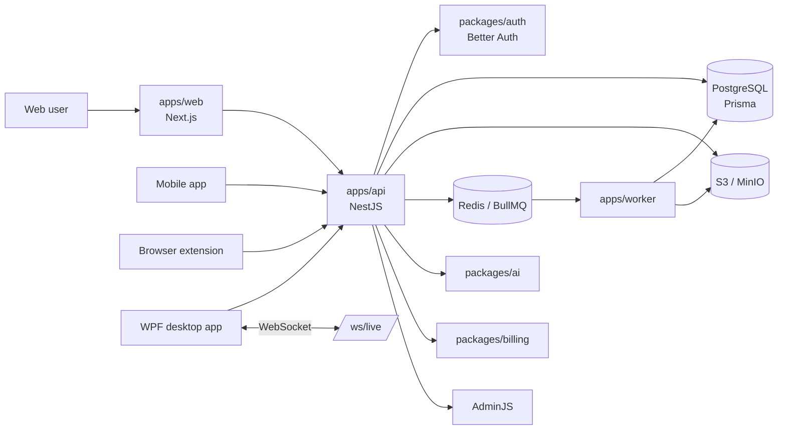

<p align="center">
  
</p>

<h1 align="center">OfferGO</h1>

<p align="center">
  <b>AI-платформа для поиска работы: резюме, вакансии, работодатели, отклики, подписки и live-помощник для собеседований.</b>
</p>

<p align="center">
  <a href="https://offergo.ru">offergo.ru</a>
  ·
  <a href="#quick-start">Quick start</a>
  ·
  <a href="#api">API</a>
  ·
  <a href="#architecture">Architecture</a>
  ·
  <a href="#desktop-extension-mobile">Clients</a>
</p>

<p align="center">
  <a href="https://offergo.ru"></a>
  <a href="#stack"></a>
  <a href="#stack"></a>
  <a href="#database"></a>
  <a href="#quick-start"></a>
</p>

<p align="center">
  
  
  
  
  
  
  
</p>

---

## Product

OfferGO объединяет основные сценарии поиска работы в одном продукте: пользователь создаёт резюме, анализирует его, ищет вакансии и работодателей, генерирует индивидуальные отклики, подключает автоотклики через расширение и использует desktop live-помощника на собеседовании.

<table>
  <tr>
    <td><b>Resume Builder</b></td>
    <td>Wizard-резюме, фото с настройкой области, просмотр, редактирование, печать, PDF/DOCX/TXT export.</td>
  </tr>
  <tr>
    <td><b>Cover Materials</b></td>
    <td>Индивидуальные отклики одним AI-запросом, история, автоотклики через browser extension.</td>
  </tr>
  <tr>
    <td><b>Vacancies</b></td>
    <td>Банк вакансий в Postgres, фильтры, детальная карточка, события просмотра и переходов.</td>
  </tr>
  <tr>
    <td><b>Employer Bank</b></td>
    <td>Каталог работодателей, сайты компаний, админское управление данными.</td>
  </tr>
  <tr>
    <td><b>Interview Assistant</b></td>
    <td>WPF-клиент, WebSocket live-сессия, аудио, скриншоты, текстовые запросы и подсказки.</td>
  </tr>
  <tr>
    <td><b>Billing & Quotas</b></td>
    <td>Тарифы, лимиты, usage counters, paywall-ответы API и страница подписки.</td>
  </tr>
  <tr>
    <td><b>Legal & Compliance</b></td>
    <td>Версионированные документы, consent acceptance, cookie banner, production gates.</td>
  </tr>
</table>

## Stack

| Layer | Technology |
| --- | --- |
| Web | Next.js 16, React 19, TypeScript, Tailwind CSS, shadcn/ui, PlateJS |
| API | NestJS 11, Express 5, Swagger/OpenAPI, AdminJS |
| Auth | Better Auth, web cookies, bearer sessions for desktop/extension/mobile |
| Data | PostgreSQL, Prisma, migrations, import scripts |
| Queue | Redis, BullMQ worker runtime |
| Storage | S3-compatible storage / MinIO locally |
| AI | AI provider layer in `packages/ai`, prompt management, structured generation |
| Billing | Plan, entitlement, quota and payment integration layer |
| Desktop | WPF client for live interview assistant |
| Extension | Chromium extension for auto-responses |
| Runtime | Docker Compose, Caddy-ready deployment, server scripts |

<a id="architecture"></a>

## Architecture



## Repository Map

```text
apps/
  api/        NestJS API, Swagger, AdminJS, auth, billing, resumes, vacancies, live
  web/        Next.js application, dashboards, public pages, Next proxy routes
  worker/     BullMQ workers and background tasks

packages/
  ai/         AI adapters and generation helpers
  auth/       Better Auth integration and session helpers
  billing/    plans, entitlements, quotas, payment contracts
  db/         Prisma schema, migrations, seed, import scripts
  queue/      queue names and payload contracts
  shared/     shared env, DTOs, enums and utilities
  ui/         reusable UI helpers

browser-extension/ browser extension source for auto-responses

wpf/
  TutorOverlay.Client/ WPF desktop assistant
  native/              native capture helper

docs/        architecture, deployment and runbooks
scripts/     Docker-first local and server commands
```

<a id="quick-start"></a>

## Quick Start

Requirements:

- Docker Engine or Docker Desktop
- Docker Compose v2
- Git
- pnpm 10.x for non-Docker local checks

Windows PowerShell:

```powershell
powershell -ExecutionPolicy Bypass -File scripts/project.ps1 setup
```

Linux/macOS:

```bash
make setup
```

Without `make`:

```bash
sh scripts/project.sh setup
```

Local URLs:

| Service | URL |
| --- | --- |
| Web | `http://localhost:3000` |
| API health | `http://localhost:3001/api/v1/health` |
| Swagger UI | `http://localhost:3001/api/docs` |
| OpenAPI JSON | `http://localhost:3001/api/docs-json` |
| AdminJS | `http://localhost:3001/adminjs` |
| MinIO console | `http://localhost:9001` |

## Development Commands

```bash
pnpm install
pnpm db:generate
pnpm --filter @offergo/api typecheck
pnpm --filter @offergo/web typecheck
pnpm --filter @offergo/api build
pnpm --filter @offergo/web build
```

Docker workflow:

```bash
make dev       # start local project in Docker
make build     # build images
make seed      # run seed
make deploy    # pull/build/db-sync/restart on server
make restart   # restart app services
make health    # check services and API health
make logs      # compose logs
```

Windows equivalents:

```powershell
pnpm docker:dev
pnpm docker:build
pnpm docker:deploy
pnpm docker:restart
pnpm docker:health
```

<a id="api"></a>

## API

Primary API base:

```text
https://offergo.ru/api/v1
```

Local API base:

```text
http://localhost:3001/api/v1
```

Documentation:

```text
https://offergo.ru/api/docs
http://localhost:3001/api/docs
```

Main API groups:

| Area | Endpoints |
| --- | --- |
| Auth | `/auth/mobile/*`, `/auth/app/*`, `/auth/extension/*`, `/auth/me` |
| Legal | `/legal-documents`, `/legal/consents/*` |
| Billing | `/billing/subscription` |
| Dashboard | `/dashboard/summary` |
| Resumes | `/resumes`, `/resumes/builder-drafts`, `/resumes/:id/builder`, `/resumes/upload` |
| Resume export | `/resumes/:id/builder/export`, `/resumes/:id/builder/photo` |
| Cover materials | `/cover-materials/individual-responses/*`, `/cover-materials/auto-responses/*` |
| Vacancies | `/vacancies`, `/vacancies/filters`, `/vacancies/:id`, `/vacancies/:id/events` |
| Admin | `/admin/vacancies`, `/admin/*` |
| Live assistant | `/settings/bootstrap`, `/sessions`, `/sessions/:id/screenshot`, `/ws/live` |

Mobile and desktop clients should call the backend API directly. Next.js proxy routes under `/api/*` are for the web app only.

<a id="database"></a>

## Database

Prisma schema:

```text
packages/db/prisma/schema.prisma
```

Useful commands:

```bash
pnpm --filter @offergo/db db:generate
pnpm --filter @offergo/db db:migrate
pnpm --filter @offergo/db db:seed
pnpm --filter @offergo/db import:vacancies
```

The vacancy import is idempotent and stores every row as a first-class `Vacancy` record, not as a JSON blob.

## Admin

AdminJS is available at:

```text
https://offergo.ru/adminjs
http://localhost:3001/adminjs
```

Admin access is role-based. Do not hardcode credentials in the repository. Use configured users and roles through the auth/admin flow.

<a id="desktop-extension-mobile"></a>

## Desktop, Extension, Mobile

| Client | Purpose | Auth |
| --- | --- | --- |
| Web | Main product UI | Better Auth web session |
| Mobile | Native app API client | `/api/v1/auth/mobile/*` bearer token |
| WPF | Live interview assistant | browser-approved desktop bearer session |
| Extension | Auto-responses helper | extension connection code and bearer token |

WPF build:

```powershell
dotnet restore wpf/TutorOverlay.Client/TutorOverlay.Client.csproj
dotnet build wpf/TutorOverlay.Client/TutorOverlay.Client.csproj
```

Extension archive for users is served from:

```text
/extensions/offergo-auto-responses.zip
```

## Deployment

Current production target is a Docker Compose host behind a domain/proxy.

Minimum server flow:

```bash
git pull --ff-only
make deploy
make health
```

Deployment rules:

- application code is deployed from Git, not by manual file edits on the server;
- database changes go through Prisma migrations/import scripts;
- secrets stay in `.env` or deployment secrets, never in Git;
- generated archives, keys and local datasets are ignored by `.gitignore`;
- production should expose only web/API/proxy ports publicly.

## Quality Gates

Before merging meaningful changes:

```bash
pnpm --filter @offergo/db db:generate
pnpm --filter @offergo/api typecheck
pnpm --filter @offergo/web typecheck
pnpm --filter @offergo/api build
pnpm --filter @offergo/web build
```

For WPF changes:

```powershell
dotnet build wpf/TutorOverlay.Client/TutorOverlay.Client.csproj
```

## Security Notes

- Do not commit `.env`, private SSH keys, extension private keys or production exports.
- Use HTTPS in production for web, API and extension flows.
- Keep legal document versions and consent acceptance records in the database.
- Use AdminJS only for trusted admin users.
- Treat resume content, photos, files, screenshots, transcripts and vacancies pasted by users as personal or sensitive user data.

## Links

| Resource | Link |
| --- | --- |
| Production | `https://offergo.ru` |
| Swagger | `https://offergo.ru/api/docs` |
| Runbook | [`docs/runbook.md`](./docs/runbook.md) |
| Architecture | [`docs/architecture.md`](./docs/architecture.md) |
| Deployment | [`docs/deployment.md`](./docs/deployment.md) |
| Development workflow | [`docs/development-workflow.md`](./docs/development-workflow.md) |
| Billing | [`docs/billing-platega.md`](./docs/billing-platega.md) |

## License

Private commercial project. Choose and add an explicit license before public distribution.
