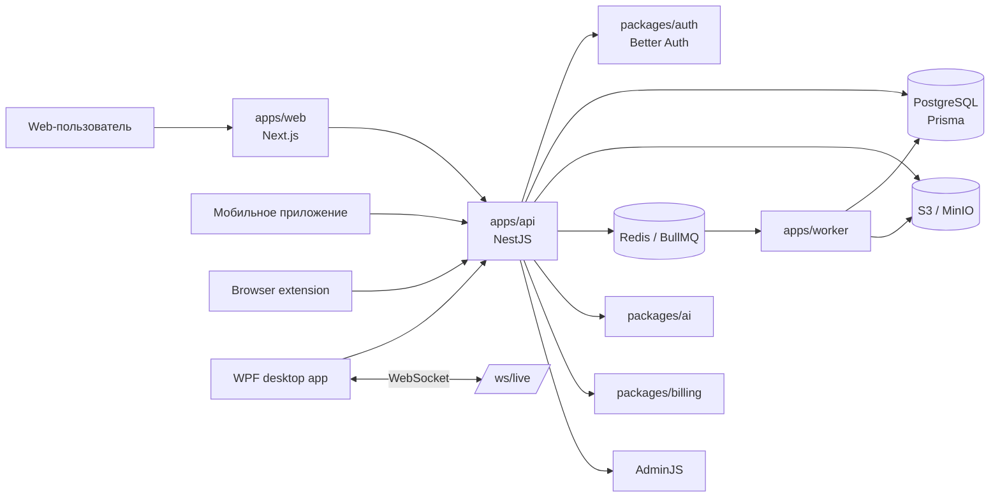

<p align="center">
  
</p>

<h1 align="center">OfferGO</h1>

<p align="center">
  <b>AI-платформа для поиска работы: резюме, вакансии, работодатели, отклики, подписки и live-помощник для собеседований.</b>
</p>

<p align="center">
  <a href="https://offergo.ru">offergo.ru</a>
  |
  <a href="#quick-start">Быстрый старт</a>
  |
  <a href="#api">API</a>
  |
  <a href="#architecture">Архитектура</a>
  |
  <a href="#clients">Клиенты</a>
</p>

<p align="center">
  <a href="https://offergo.ru"></a>
  <a href="#stack"></a>
  <a href="#stack"></a>
  <a href="#database"></a>
  <a href="#quick-start"></a>
</p>

<p align="center">
  
  
  
  
  
  
  
</p>

---

## Что такое OfferGO

OfferGO объединяет основные сценарии поиска работы в одном продукте: пользователь создаёт резюме, анализирует его, смотрит вакансии и работодателей, генерирует индивидуальные отклики, подключает автоотклики через расширение и использует desktop live-помощника на собеседовании.

<table>
  <tr>
    <td><b>Конструктор резюме</b></td>
    <td>Wizard-резюме, фото с настройкой области, просмотр, редактирование, печать, экспорт в PDF/DOCX/TXT.</td>
  </tr>
  <tr>
    <td><b>Сопроводительные материалы</b></td>
    <td>Индивидуальные отклики одним AI-запросом, история генераций, автоотклики через browser extension.</td>
  </tr>
  <tr>
    <td><b>Вакансии</b></td>
    <td>Банк вакансий в Postgres, фильтры, детальная карточка, события просмотров и переходов.</td>
  </tr>
  <tr>
    <td><b>Банк работодателей</b></td>
    <td>Каталог работодателей, сайты компаний, список открытых данных и админское управление.</td>
  </tr>
  <tr>
    <td><b>Помощник на собеседовании</b></td>
    <td>WPF-клиент, WebSocket live-сессия, аудио, скриншоты, текстовые запросы и подсказки.</td>
  </tr>
  <tr>
    <td><b>Подписки и лимиты</b></td>
    <td>Тарифы, usage counters, paywall-ответы API, контроль лимитов и страница подписки.</td>
  </tr>
  <tr>
    <td><b>Юридический контур</b></td>
    <td>Версионированные документы, фиксация согласий, cookie banner и production-проверки окружения.</td>
  </tr>
</table>

<a id="stack"></a>

## Технологический стек

| Слой | Технологии |
| --- | --- |
| Web | Next.js 16, React 19, TypeScript, Tailwind CSS, shadcn/ui, PlateJS |
| API | NestJS 11, Express 5, Swagger/OpenAPI, AdminJS |
| Auth | Better Auth, web cookies, bearer sessions для desktop/extension/mobile |
| Data | PostgreSQL, Prisma, migrations, import scripts |
| Queue | Redis, BullMQ worker runtime |
| Storage | S3-compatible storage / MinIO locally |
| AI | AI provider layer в `packages/ai`, prompt management, structured generation |
| Billing | Тарифы, entitlement, quota и payment integration layer |
| Desktop | WPF-клиент для live-помощника на собеседовании |
| Extension | Chromium extension для автооткликов |
| Runtime | Docker Compose, server scripts, Caddy-ready deployment |

<a id="architecture"></a>

## Архитектура



## Структура репозитория

```text
apps/
  api/        NestJS API, Swagger, AdminJS, auth, billing, resumes, vacancies, live
  web/        Next.js приложение, dashboard, публичные страницы, Next proxy routes
  worker/     BullMQ workers и фоновые задачи

packages/
  ai/         AI adapters и helpers генерации
  auth/       Better Auth integration и session helpers
  billing/    plans, entitlements, quotas, payment contracts
  db/         Prisma schema, migrations, seed, import scripts
  queue/      queue names и payload contracts
  shared/     shared env, DTOs, enums и utilities
  ui/         reusable UI helpers

browser-extension/ browser extension source для автооткликов

wpf/
  TutorOverlay.Client/ WPF desktop assistant
  native/              native capture helper

docs/        архитектура, деплой и runbooks
scripts/     Docker-first команды для локального и серверного запуска
```

<a id="quick-start"></a>

## Быстрый старт

Требования:

- Docker Engine или Docker Desktop
- Docker Compose v2
- Git
- pnpm 10.x для локальных проверок без Docker

Windows PowerShell:

```powershell
powershell -ExecutionPolicy Bypass -File scripts/project.ps1 setup
```

Linux/macOS:

```bash
make setup
```

Без `make`:

```bash
sh scripts/project.sh setup
```

Локальные адреса:

| Сервис | URL |
| --- | --- |
| Web | `http://localhost:3000` |
| API health | `http://localhost:3001/api/v1/health` |
| Swagger UI | `http://localhost:3001/api/docs` |
| OpenAPI JSON | `http://localhost:3001/api/docs-json` |
| AdminJS | `http://localhost:3001/adminjs` |
| MinIO console | `http://localhost:9001` |

## Команды разработки

```bash
pnpm install
pnpm db:generate
pnpm --filter @offergo/api typecheck
pnpm --filter @offergo/web typecheck
pnpm --filter @offergo/api build
pnpm --filter @offergo/web build
```

Docker workflow:

```bash
make dev       # локальный запуск проекта в Docker
make build     # сборка images
make seed      # запуск seed
make deploy    # pull/build/db-sync/restart на сервере
make restart   # перезапуск app-сервисов
make health    # проверка сервисов и API health
make logs      # compose logs
```

Windows equivalents:

```powershell
pnpm docker:dev
pnpm docker:build
pnpm docker:deploy
pnpm docker:restart
pnpm docker:health
```

<a id="api"></a>

## API

Основной API base:

```text
https://offergo.ru/api/v1
```

Локальный API base:

```text
http://localhost:3001/api/v1
```

Документация:

```text
https://offergo.ru/api/docs
http://localhost:3001/api/docs
```

Основные группы API:

| Область | Endpoints |
| --- | --- |
| Auth | `/auth/mobile/*`, `/auth/app/*`, `/auth/extension/*`, `/auth/me` |
| Legal | `/legal-documents`, `/legal/consents/*` |
| Billing | `/billing/subscription` |
| Dashboard | `/dashboard/summary` |
| Resumes | `/resumes`, `/resumes/builder-drafts`, `/resumes/:id/builder`, `/resumes/upload` |
| Resume export | `/resumes/:id/builder/export`, `/resumes/:id/builder/photo` |
| Cover materials | `/cover-materials/individual-responses/*`, `/cover-materials/auto-responses/*` |
| Vacancies | `/vacancies`, `/vacancies/filters`, `/vacancies/:id`, `/vacancies/:id/events` |
| Admin | `/admin/vacancies`, `/admin/*` |
| Live assistant | `/settings/bootstrap`, `/sessions`, `/sessions/:id/screenshot`, `/ws/live` |

Мобильный клиент, desktop-клиент и расширение должны ходить напрямую в backend API. Next.js proxy routes под `/api/*` предназначены только для web-приложения.

<a id="database"></a>

## База данных

Prisma schema:

```text
packages/db/prisma/schema.prisma
```

Полезные команды:

```bash
pnpm --filter @offergo/db db:generate
pnpm --filter @offergo/db db:migrate
pnpm --filter @offergo/db db:seed
pnpm --filter @offergo/db import:vacancies
```

Импорт вакансий идемпотентный: каждая строка сохраняется как полноценная запись `Vacancy`, а не как JSON blob.

## Администрирование

AdminJS доступен по адресам:

```text
https://offergo.ru/adminjs
http://localhost:3001/adminjs
```

Доступ в админку зависит от роли пользователя. Логины, пароли, ключи и production-секреты нельзя хранить в репозитории.

<a id="clients"></a>

## Клиенты

| Клиент | Назначение | Авторизация |
| --- | --- | --- |
| Web | Основной интерфейс продукта | Better Auth web session |
| Mobile | Нативное приложение | `/api/v1/auth/mobile/*` bearer token |
| WPF | Live-помощник на собеседовании | browser-approved desktop bearer session |
| Extension | Автоотклики | код подключения расширения и bearer token |

Сборка WPF:

```powershell
dotnet restore wpf/TutorOverlay.Client/TutorOverlay.Client.csproj
dotnet build wpf/TutorOverlay.Client/TutorOverlay.Client.csproj
```

Архив расширения для пользователей отдаётся по адресу:

```text
/extensions/offergo-auto-responses.zip
```

## Деплой

Текущая production-цель: Docker Compose host за доменом и reverse proxy.

Минимальный серверный flow:

```bash
git pull --ff-only
make deploy
make health
```

Правила деплоя:

- код приложения деплоится из Git, а не ручными правками на сервере;
- изменения БД проходят через Prisma migrations и import scripts;
- секреты остаются в `.env` или deployment secrets, но не попадают в Git;
- generated archives, ключи и локальные datasets игнорируются через `.gitignore`;
- наружу должны быть открыты только web/API/proxy ports.

## Проверки качества

Перед merge значимых изменений:

```bash
pnpm --filter @offergo/db db:generate
pnpm --filter @offergo/api typecheck
pnpm --filter @offergo/web typecheck
pnpm --filter @offergo/api build
pnpm --filter @offergo/web build
```

Для изменений WPF:

```powershell
dotnet build wpf/TutorOverlay.Client/TutorOverlay.Client.csproj
```

## Безопасность

- Не коммитить `.env`, приватные SSH-ключи, private key расширения и production-exports.
- В production использовать HTTPS для web, API и extension flows.
- Хранить версии юридических документов и факты принятия согласий в БД.
- Открывать AdminJS только доверенным администраторам.
- Считать резюме, фото, файлы, скриншоты, транскрипты и данные вакансий пользовательскими или чувствительными данными.

## Ссылки

| Ресурс | Ссылка |
| --- | --- |
| Production | `https://offergo.ru` |
| Swagger | `https://offergo.ru/api/docs` |
| Runbook | [`docs/runbook.md`](./docs/runbook.md) |
| Архитектура | [`docs/architecture.md`](./docs/architecture.md) |
| Деплой | [`docs/deployment.md`](./docs/deployment.md) |
| Workflow разработки | [`docs/development-workflow.md`](./docs/development-workflow.md) |
| Billing | [`docs/billing-platega.md`](./docs/billing-platega.md) |

## Лицензия

Приватный коммерческий проект. Перед публичным распространением нужно явно выбрать и добавить лицензию.
